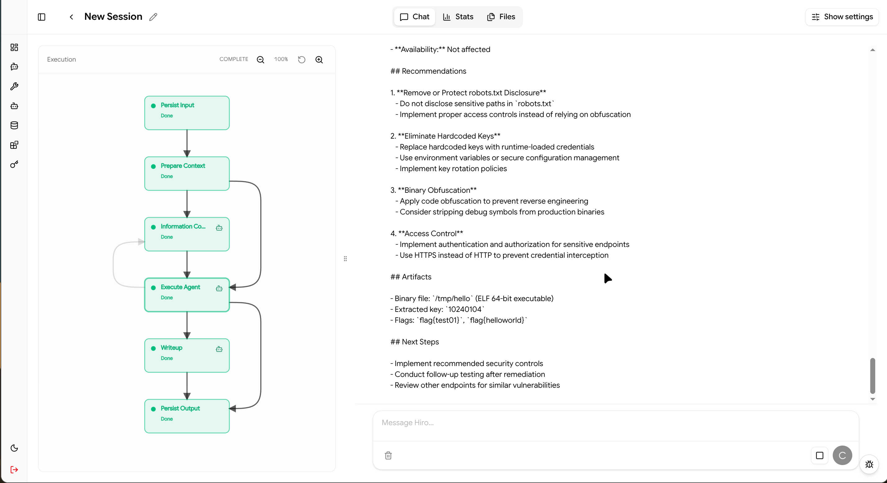
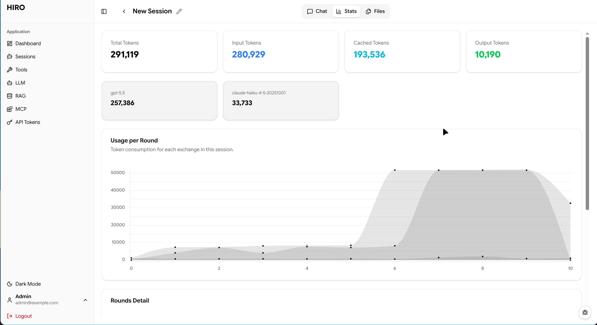

# Hiro

[简体中文](README_zh-CN.md)

Hiro is an AI-assisted penetration testing and CTF workflow platform. It combines a FastAPI backend, a Vue web UI, DeepAgents/LangGraph-style agent execution, session-scoped file storage, optional RAG context, MCP tool integration, and specialized workflow agents for reconnaissance and writeups.

> [!CAUTION]
> **Disclaimer**
>
> Hiro is intended only for authorized security research, education, internal validation, and CTF environments. Do not use it against systems without explicit permission. You are solely responsible for complying with applicable laws, authorization scope, rules of engagement, and third-party service terms. The authors and contributors are not responsible for unauthorized access, service disruption, data loss, legal consequences, or other damages caused by use or misuse of this project. Hiro may execute model-directed tools and shell commands; review targets, commands, outputs, and generated artifacts before acting on them.

> [!IMPORTANT]
> Hiro is under rapid development and contains a significant amount of LLM-generated code. Security issues, serious bugs, breaking changes, and incomplete features may exist. Treat this project as experimental: review the code, configuration, generated commands, and deployment environment carefully before use, and avoid running it in production or sensitive environments without additional hardening.

## Screenshots

The screenshots below show the current desktop Web UI. Hiro is changing quickly, so details may differ from the latest build.

### Chat



### Token Usage Statistics



## Repository Layout

```text
.
+-- main.py                    # FastAPI entrypoint
+-- pyproject.toml             # Python project metadata and dependencies
+-- server/                    # API, models, agent runtime, graph, tools, services
|   +-- agent/                 # Agent graph, runtime, streaming, subagents, tools
|   +-- api/v1/endpoints/      # REST and WebSocket endpoints
|   +-- core/                  # Settings, security, installation, utility helpers
|   +-- models/                # SQLAlchemy models
|   +-- service/               # RAG and MCP services
+-- skills/                    # DeepAgent skill instructions
+-- tests/                     # Backend test suite
+-- web/                       # Vue frontend
```

## Requirements

- Linux is recommended. Agent shell execution depends on Bubblewrap.
- Python 3.12 or newer.
- `uv` for Python dependency management.
- Node.js 20 or newer and npm.
- System tools checked by the installer:
  - `curl`
  - `wget`
  - `bwrap` from the `bubblewrap` package
  - `feroxbuster`

## Quick Start

Start the backend:

```bash
uv sync
uv run python main.py
```

The API runs on `http://localhost:8000`.

In a second terminal, start the web UI:

```bash
cd web
npm install
npm run dev
```

Open `http://localhost:5173`.

During development, Vite proxies `/api` requests to `http://localhost:8000`, so no extra frontend API configuration is needed for the default setup.

## First-Time Installation

When Hiro is not installed, the web UI redirects to `/install`.

1. Enter a database DSN. For local development, use:

   ```text
   sqlite:///./hiro.db
   ```

2. Run the environment check. The installer verifies `wget`, `curl`, `bwrap`, and `feroxbuster`.
3. Create the admin account.
4. Hiro writes installation settings to `.env`, creates database tables, and restarts the backend process.
5. Sign in at `/login` with the admin username and password you created.

The installer writes:

```text
DATABASE_URL=...
INSTALLATION_COMPLETED=true
```

For production-like deployments, set a strong `SECRET_KEY` in `.env` before exposing the service.

## Configuration

Hiro reads settings from environment variables and `.env` via Pydantic settings.

Common settings:

```text
PROJECT_NAME=Hiro API
PROJECT_DESCRIPTION=A scalable FastAPI application
VERSION=0.1.0
SECRET_KEY=change-this-value
API_KEY_HEADER=X-API-Key
DATABASE_URL=sqlite:///./hiro.db
INSTALLATION_COMPLETED=true
ALLOWED_ORIGINS=["*"]
```

The default database is SQLite at `./hiro.db`. Other SQLAlchemy database URLs may work when the matching async driver is installed and the URL uses the correct async dialect.

## Using the App

### 1. Configure an LLM

Open the LLM page and create a provider configuration.

Supported UI provider types:

- `openai`
- `anthropic`

> [!NOTE]
> If you want to use LLMs through CLI (Gemini CLI, ChatGPT Codex i.e.) or LLMs with other providers (Codex, Gemini), please refer to [CLIProxyAPI](https://github.com/router-for-me/CLIProxyAPI) project.

You can also provide a custom base URL for OpenAI-compatible or Anthropic-compatible gateways. The model selected in a session can be overridden per workflow agent, such as `main_agent`, `information_collect_agent`, and `writeup_agent`.

### 2. Create a Session

Open Sessions, create or select a session, choose the LLM config, enable optional tools/MCP/RAG, and send a prompt. The session page streams:

- assistant text
- inline tool calls
- MCP tool events
- execution graph node and edge status
- token usage
- final persisted messages

### 3. Use RAG

Open RAG to upload documents or register document sources. Hiro indexes supported documents into the configured vector store and can inject relevant snippets into agent runs when RAG is enabled for a session.

Embedding providers supported by the backend:

- OpenAI
- Cohere
- Ollama

Vector storage defaults to Milvus Lite (`hiro_rag.db`) and can also target a remote Milvus endpoint.

### 4. Configure MCP Servers

Open MCP to add and test MCP servers. Hiro stores each server configuration and loads selected MCP tools for a session. The agent receives router-style access through `mcp_search` and `mcp_call` instead of eagerly exposing every remote tool.

### 5. Generate API Tokens

Open API Tokens to create tokens for API access. Use generated tokens with:

```text
X-API-Key: hiro_...
```

JWT bearer tokens are issued by `/api/v1/auth/login` for browser login.

## Development

Run backend tests:

```bash
uv run pytest
```

Build the frontend:

```bash
cd web
npm run build
```

Run the frontend preview after building:

```bash
cd web
npm run preview
```

## Security Notes

Hiro executes model-directed tools and shell commands for testing workflows. Keep it on trusted networks, use it only for authorized assessments, and review generated commands and artifacts. Bubblewrap improves isolation but should not be treated as a complete multi-tenant security boundary.

Change the default `SECRET_KEY` before sharing an instance. Do not commit `.env`, database files, RAG stores, or `data/` artifacts if they contain sensitive information.

## License

MIT LICENSE
